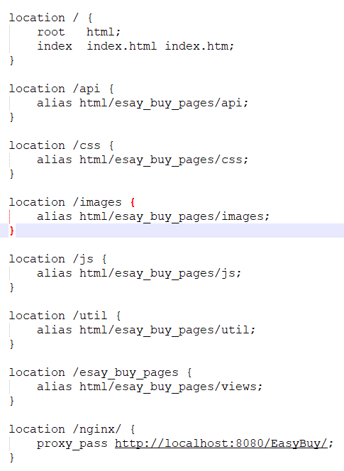

1、同步项目
2、将项目放到本地nginx中的html中，可创建文件夹放置

3、配置conf下的nginx.conf配置，添加如下两个配置
端口自行配置: 5173（可不进行更改）

4、开启服务
5、通过ide打开文件夹

6、编写对应代码并保存，页面刷新，同步编写代码
7、页面访问

出现nginx未启动成功，查看配置文件是否错误
查看端口是否被占用

nginx.conf配置如下

location /api {
alias html/esay_buy_pages/api;
}

		location /css {
			alias html/esay_buy_pages/css;
		}
		
		location /images {
			alias html/esay_buy_pages/images;
		}
		
		location /js {
			alias html/esay_buy_pages/js;
		}
		
		location /util {
			alias html/esay_buy_pages/util;
		}
		
		location /esay_buy_pages {
			alias html/esay_buy_pages/views;
		}
		
		location /nginx/ {
			proxy_pass http://localhost:8080/EasyBuy/;
		}
